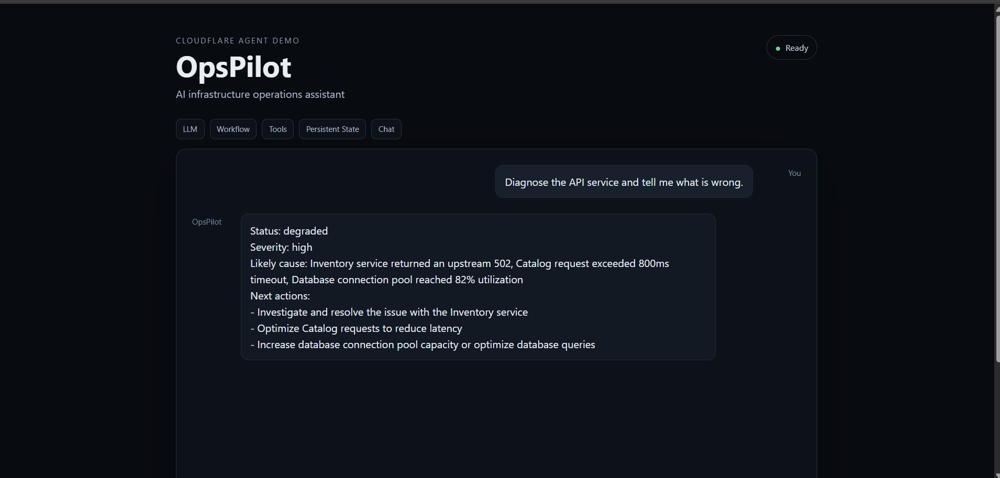

# 🛰️ OpsPilot — AI Infrastructure Operations Agent

A small, explainable AI assistant for infrastructure operations, built with **Cloudflare Agents** and **Workers AI**. Ask it about a service's health, and it checks status, inspects recent errors, and classifies incident severity through typed server-side tools.

Built for Cloudflare's optional Agents assignment.


## 🚀 Live Demo

**[opspilot-ai-agent.codewithhr.workers.dev](https://opspilot-ai-agent.codewithhr.workers.dev/)**



---

## 📑 Table of Contents

- [Assignment requirements](#-assignment-requirements)
- [Features](#-features)
- [Architecture](#️-architecture)
- [Demo prompts](#-demo-prompts)
- [Local setup](#️-local-setup)
- [Deploy](#-deploy)
- [Design decisions](#-design-decisions)
- [Why the telemetry is simulated](#-why-the-telemetry-is-simulated)

---

## ✅ Assignment requirements

| Cloudflare requirement  | Implementation |
|-------------------------|----------------|
| **LLM**                 | Cloudflare Workers AI (`@cf/meta/llama-4-scout-17b-16e-instruct`) |
| **Workflow / coordination** | `runIncidentDiagnosis` runs a sequential workflow: health check → error inspection → severity classification |
| **User input via chat** | React chat UI using `useAgentChat` over the Agents WebSocket protocol |
| **Memory / state**      | `AIChatAgent` persists conversation messages; agent state stores the active service, last incident, and check count in Durable Object SQLite |

---

## ✨ Features

- Stateful chat agent
- Server-side tools with typed schemas
- Coordinated multi-step incident diagnosis
- Persistent conversation history
- Persistent operational state
- Separate agent session per browser
- Simulated telemetry, so it runs without external monitoring credentials
- Responsive React UI

---

## 🏗️ Architecture

```text
React Chat UI
      |
      | WebSocket chat
      v
Cloudflare AIChatAgent (Durable Object)
      |
      +--> Intent router (diagnose / lookup / state)
      |
      +--> Workers AI LLM
      |
      +--> Tools
      |     +--> service health
      |     +--> recent errors
      |     +--> incident diagnosis workflow
      |     +--> persistent state
      |
      +--> SQLite-backed conversation/state
```

---

## 💬 Demo prompts

Try these in the chat:

- `Diagnose the API service and tell me what is wrong.`
- `Check search health and recent errors.`
- `Run an incident diagnosis for payments.`
- `What do you remember about the last incident?`
- `Show me the current agent state.`

---

## ⚙️ Local setup

**Requirements:** Node.js 18+ and a Cloudflare account with Workers AI enabled.

```bash
npm install
npm run dev
```

Open the local Vite URL printed in the terminal.

---

## ☁️ Deploy

Authenticate Wrangler:

```bash
npx wrangler login
```

Then deploy:

```bash
npm run deploy
```

The first deployment creates the Durable Object-backed agent and the Workers AI binding from `wrangler.jsonc`.

---

## 🧠 Design decisions

**LLM:** Workers AI writes the operator-facing answer. Clear diagnose, lookup, and state requests are detected in code and answered from verified data, so the model only narrates facts and cannot invent telemetry. Open-ended requests fall back to model-driven tool calling.

**Workflow:** `runIncidentDiagnosis` coordinates three stages: health check, error inspection, and severity classification. Each stage feeds the next.

**State:** The Durable Object agent persists the conversation and an `OpsState` object containing the active service, last incident, and number of checks.

**Tools:** The model never touches internal data directly. Data access goes through typed server-side functions, and open-ended requests use tools defined with Zod schemas, which makes each integration explicit and testable.

**Scalability:** The Agents runtime gives each agent instance a durable identity and its own state. Workers AI runs the model call at the edge, and the tool layer can later call real APIs.

---

## 🧪 Why the telemetry is simulated

The assignment doesn't require a connection to a real production monitoring system. Simulated telemetry keeps the demo deterministic, credential-free, and easy to explain.

The tool boundaries are designed so the simulated functions can later be replaced with real observability APIs.
